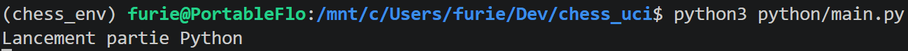
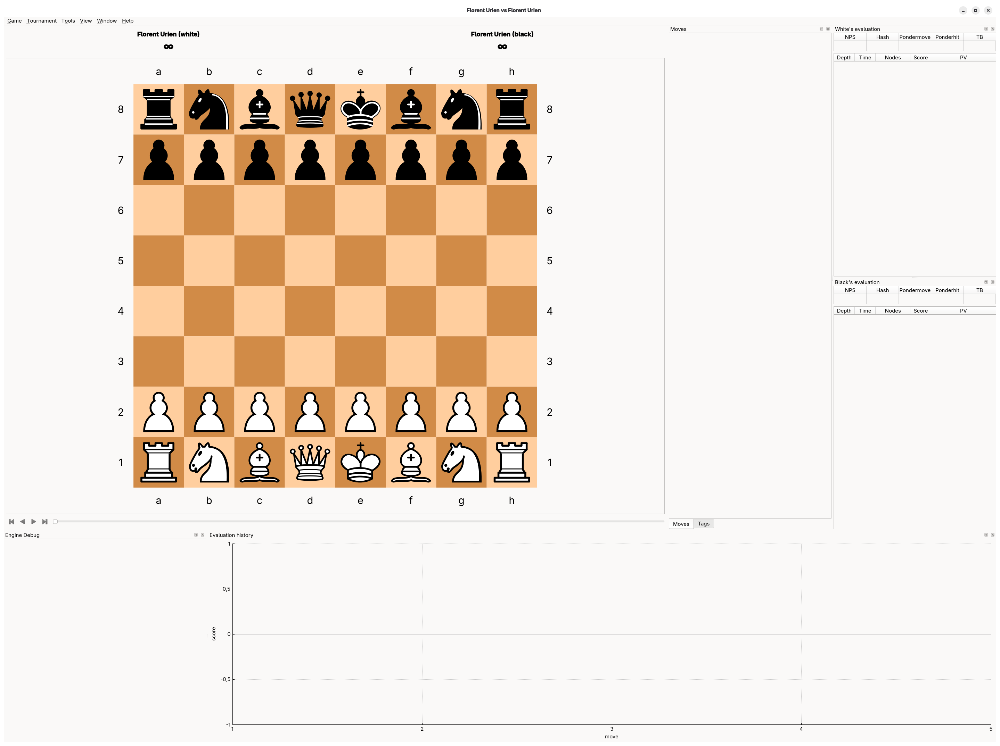
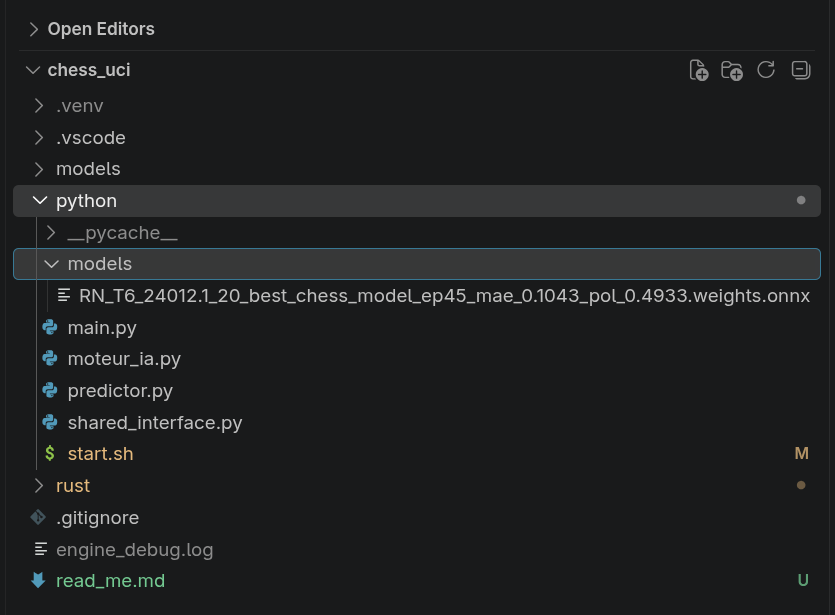

# Préambule

A ce stade le réseau de neurones a été éduqué préalablement en Python. Il sait analyser une position. Il faut maintenant que l'ordinateur puisse jouer une partie.

J'utilise pour choisir entre les différents coups possibles l'algo du **MCTS** (*Monte Carlo Training Search*).

Pour pouvoir être efficace dans ce parcours arborescent la partie MCTS est écrite dans un langage performant mais complexe à maîtriser le **RUST**, la partie réseau de neurones pure restant en **Python**.

Comme 2 langages différents sont utilisés, l'éditeur ne sera pas **Pycharm** mais **VS code**.

Ces deux parties distinctes communiquent via une <mark>shared memory</mark>.

Le programme est conçu principalement pour tourner sous <mark>Fedora sur mon ordinateur fixe avec sa radeon 6650XT</mark>. Néanmoins il peut être pratique de pouvoir travailler dessus à partir de <mark>mon ordinateur portable sous W11</mark>.

Dans les deux cas il sera intéressant d'inspecter le fichier <mark>engine_debug.log</mark> pour analyser le fonctionnement.

# Adaptation pour tourner sur le portable sous W11

J'ai installé <mark>wsl</mark>.

Puis cela se lance sous <mark>Visual code</mark>.

Pour lancer le venv Python il faut tapper la commande :

`source ~/.venvs/chess_env/bin/activate`

On a alors :

`(chess_env) furie@PortableFlo:/mnt/c/Users/furie/Dev/chess_uci$ pip list
Package                Version`

---------------------- ---------

`cuda-bindings          13.4.3
cuda-pathfinder        1.8.2
cuda-toolkit           13.0.3.0
filelock               4.0.3
fsspec                 2026.9.0
Jinja2                 3.1.6
MarkupSafe             3.0.3
ml_dtypes              0.6.0
mpmath                 1.3.0
networkx               3.7
numpy                  2.5.3
nvidia-cublas          13.1.1.3
nvidia-cuda-cupti      13.0.85
nvidia-cuda-nvrtc      13.0.88
nvidia-cuda-runtime    13.0.96
nvidia-cudnn-cu13      9.24.0.43
nvidia-cufft           12.0.0.61
nvidia-cufile          1.15.1.6
nvidia-curand          10.4.0.35
nvidia-cusolver        12.0.4.66
nvidia-cusparse        12.6.3.3
nvidia-cusparselt-cu13 0.8.1
nvidia-nccl-cu13       2.30.7
nvidia-nvjitlink       13.4.92
nvidia-nvshmem-cu13    3.4.5
nvidia-nvtx            13.0.85
onnx                   1.23.0
onnx2torch             1.5.15
pillow                 12.3.0
pip                    25.1.1
protobuf               7.36.2
setuptools             84.0.0
sympy                  1.14.0
torch                  2.14.0
torchvision            0.29.0
triton                 3.8.0
typing_extensions      4.16.0`

Et l'on peut lancer la partie python pour test avec la commande :

Pour lancer tout il faudra utiliser la commande :

`source start_clean.sh`

# Le lanceur des parties Python et Rust

C'est le batch <mark>/python/start.sh</mark>.

On génèrera le fichier de debug <mark>/engine_debug.log</mark>.

## Test de fonctionnement

On lance le moteur : 

`((.venv) ) florent@flo-fixe:~/Rust/chess_uci$ source start.sh`

On attend qu'il charche le réseau de neurones et qu'il soit prêt.

`Démarrage de la partie Rust
info string Attente de la mémoire partagée (lancez le script Python)...
info string Mémoire partagée connectée !
Lancement partie Python
Numéro du modèle lu 1
info string Python <- Rust (Je connecte mon model n° 1)
info string Chargement du Modèle /home/florent/Rust/chess_uci/python/models/RN_T6_24012.1_20_best_chess_model_ep45_mae_0.1043_pol_0.4933.weights
Chargement de l'accélérateur ONNX : /home/florent/Rust/chess_uci/python/models/RN_T6_24012.1_20_best_chess_model_ep45_mae_0.1043_pol_0.4933.weights.onnx
info string Le chargement du Modèle /home/florent/Rust/chess_uci/python/models/RN_T6_24012.1_20_best_chess_model_ep45_mae_0.1043_pol_0.4933.weights a réussi`

On initialise le mode <mark>uci</mark>.

`uci
<- uci
id name Florent_IA
option name Simulations type spin default 800 min 100 max 100000
option name PUCT_x10 type spin default 30 min 10 max 50
option name Temperature_x10 type spin default 20 min 1 max 100
option name Limite_stochastique type spin default 5 min 1 max 20
option name Poids_material_x10 type spin default 1 min 0 max 10
option name Poids_echecs_x10 type spin default 1 min 0 max 10
option name Numero_model type spin default 1 min 1 max 10
uciok`

On vérifie que le moteur est prêt.

`isready
<- isready
readyok`

On démarre de la position initiale.

`position startpos
<- position startpos
info string Position mise à jour, coup n°1`

Puis on lui demande de calculer son coup.

`go movetime 2000
<- go movetime 2000
Rust -> Python (connecte ton model n°1)
Numéro du modèle lu 1
info string Python <- Rust (Je connecte mon model n° 1)
info string Chargement du Modèle /home/florent/Rust/chess_uci/python/models/RN_T6_24012.1_20_best_chess_model_ep45_mae_0.1043_pol_0.4933.weights
Chargement de l'accélérateur ONNX : /home/florent/Rust/chess_uci/python/models/RN_T6_24012.1_20_best_chess_model_ep45_mae_0.1043_pol_0.4933.weights.onnx
Rust -> demande de prédiction à Python
Python <- Rust (Demande de prédiction)
Python: <- 1 tensors reçus
Python: <- 1 coups légaux reçus
rootRust : prédictions reçues
Profondeur : 1  |  Nœuds : 21
Python <- Rust (Demande de prédiction)
Python: <- 20 tensors reçus
Python: <- 20 coups légaux reçus
Rust : 20 prédictions reçues
Profondeur : 1  |  Nœuds : 421
Python <- Rust (Demande de prédiction)
Python: <- 39 tensors reçus
Python: <- 39 coups légaux reçus
Rust : 39 prédictions reçues
Profondeur : 2  |  Nœuds : 1435
Python <- Rust (Demande de prédiction)
Python: <- 64 tensors reçus
Python: <- 64 coups légaux reçus
info string Le chargement du Modèle /home/florent/Rust/chess_uci/python/models/RN_T6_24012.1_20_best_chess_model_ep45_mae_0.1043_pol_0.4933.weights a réussi
Rust : 64 prédictions reçues
Profondeur : 3  |  Nœuds : 3073
Python <- Rust (Demande de prédiction)
Python <- Rust (Demande de prédiction)
Python: <- 64 tensors reçus
Python: <- 64 coups légaux reçus
Python: <- 64 tensors reçus
Python: <- 64 coups légaux reçus
Rust : 64 prédictions reçues
Profondeur : 4  |  Nœuds : 4960
Python <- Rust (Demande de prédiction)
Python: <- 64 tensors reçus
Python: <- 64 coups légaux reçus
Rust : 64 prédictions reçues
Profondeur : 5  |  Nœuds : 6792
Python <- Rust (Demande de prédiction)
Python: <- 64 tensors reçus
Python: <- 64 coups légaux reçus
Rust : 64 prédictions reçues
Profondeur : 6  |  Nœuds : 8704
Python <- Rust (Demande de prédiction)
Python: <- 128 tensors reçus
Python: <- 128 coups légaux reçus
Rust : 128 prédictions reçues
Profondeur : 7  |  Nœuds : 12251
Python <- Rust (Demande de prédiction)
Python: <- 128 tensors reçus
Python: <- 128 coups légaux reçus
Rust : 64 prédictions reçues
Profondeur : 8  |  Nœuds : 14216
Python <- Rust (Demande de prédiction)
Python: <- 128 tensors reçus
Python: <- 128 coups légaux reçus
Rust : 128 prédictions reçues
Profondeur : 8  |  Nœuds : 18023
Python <- Rust (Demande de prédiction)
Python: <- 128 tensors reçus
Python: <- 128 coups légaux reçus
Rust : 128 prédictions reçues
Profondeur : 9  |  Nœuds : 21911
Python <- Rust (Demande de prédiction)
Python: <- 128 tensors reçus
Python: <- 128 coups légaux reçus
Rust : 128 prédictions reçues
Profondeur : 10  |  Nœuds : 25659
Total : 3.136108827s, Python: 3.115382466s, Rust: 20.726361ms
bestmove e2e4`

# Le coordinateur (Cutechess)

Il faut l'installer, ce qui n'est pas passionnant sous Fedora.

`sudo dnf install -y cmake gcc-c++ qt6-qtbase-devel qt6-qtsvg-devel git make && git clone https://github.com/cutechess/cutechess.git && cd cutechess && mkdir build && cd build && cmake -DCMAKE_BUILD_TYPE=Release .. && make -j$(nproc)`

Puis on finalise l'installation :

`sudo make install`

Et enfin on peut le lancer via :

`florent@flo-fixe:~/cutechess/build$ cutechess`

Joie, on a enfin un affichage graphique:

# La partie Python

## Le réseau de neurones

Il est stocké sous le répertoire <mark>/models</mark>.

Dans cet exemple on a un réseau Resnet, 6 têtes, appris sur 24 millions de position.

## Les 4 fichiers Python

### main.py

C'est le lanceur de la partie Python (*création de la shared memory et chargement du réseau de neurones*). Ensuite elle organise la communication entre Rust et Python.

# La partie Rust

## main.rs

On crée la mémoire partagée (*avec Python*), le canal de communication, et l'on écoute <mark>stdin</mark> sur un thread séparé (*qui communique via le canal précédent*) et dans le thread principal on lit ce canal.

## uci.rs

Dans cette partie on gère la communication <mark>uci</mark>.

Détaillons les commandes.

### "uci"

La <mark>poignée de main</mark> pour présenter le moteur et ses options.

`println!("id name Florent_IA");`

`println!("option name Simulations type spin default 800 min 100 max 100000");`

`println!("option name PUCT_x10 type spin default 30 min 10 max 50");`

`println!("option name Temperature_x10 type spin default 20 min 1 max 100");`

`println!("option name Limite_stochastique type spin default 5 min 1 max 20");`

`println!("option name Poids_material_x10 type spin default 1 min 0 max 10");`

`println!("option name Poids_echecs_x10 type spin default 1 min 0 max 10");`

`println!("option name Numero_model type spin default 1 min 1 max 10");`

`println!("uciok");`

### "setoption"

Pour entrer les valeurs des différentes options.
<mark>**A noter que l'option qui permet de changer le réseau de neurones est pour l'instant inactive, car codée en dur dans la partie Python à 1.**</mark>

### "isready"

Pour indiquer que le moteur est prêt. 

## 
